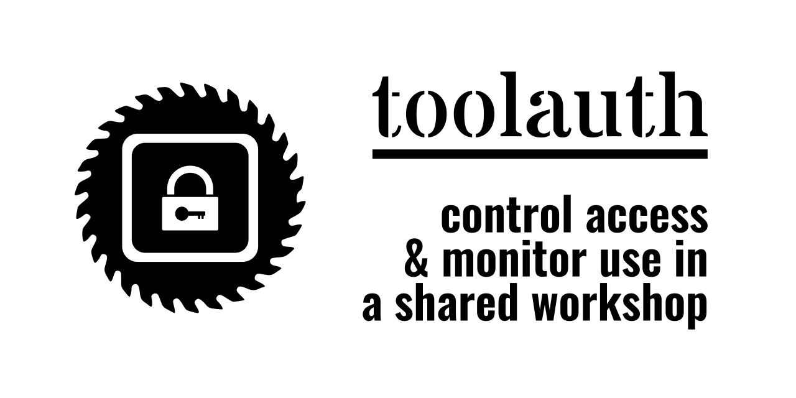

# toolauth

A simple server to handle integration of a tool authorization system with custom curcuit boards. 
Designed by and for use at MakeHaven in New Haven, CT.

## toolauth-hardware
The hardware is also custom. It can be referenced [here](https://github.com/crice009/toolauth-hardware).
